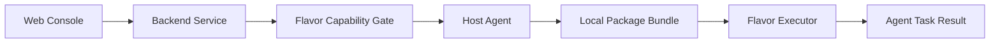

# Architecture

## Overview

DBOps Platform is a database operations system with a React web console, a Go backend, and a Go agent that executes host-side tasks. The root README identifies backend administration on port 8080, the web console on port 3000, and the agent service on port 9090.

## Components

| Component | Location | Responsibility |
| --- | --- | --- |
| Web console | `frontend/` | React, TypeScript, Ant Design user interface. |
| Backend | `backend/` | Gin HTTP service, persistence integrations, task orchestration, capability gates, and plugins. |
| Agent | `agent/` | Go host-side task execution, installation helpers, migrations, upgrades, and local package verification. |

## Lifecycle Safety Boundaries

`backend/internal/services/flavor_capability.go` is the capability gate for database flavors. Dedicated executors are required before lifecycle operations are enabled for a flavor.

`agent/internal/executor/local_package_bundle.go` validates pre-positioned package bundles. It reads `<root>/<flavor>/<version>/manifest.json`, verifies the requested flavor and version, each regular package file, its SHA-256, and a required license file. The default root is `/opt/dbops/packages`.

`backend/internal/plugins/kernel/xinchuang_core.go` provides the common lifecycle base for dedicated flavor executors. It validates the target Agent, dispatches each lifecycle phase through the flavor's Agent route, and accepts only a terminal successful Agent task status.

The local bundle validator only performs reads and hashes. Installation, extraction, downloads, and service commands are outside this validator.
