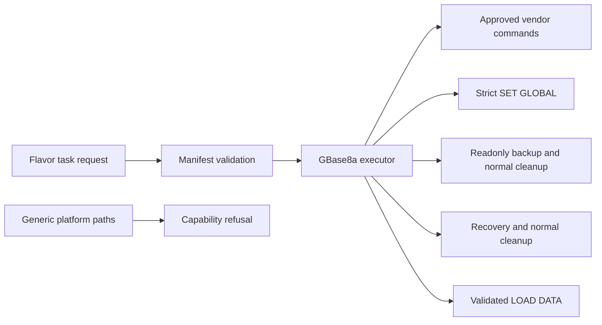

# GBase 8a 10.1 Dedicated Agent Design

Feature Name: gbase8a-10-1
Updated: 2026-08-04

## Description

The Agent adds a dedicated GBase 8a 10.1 deploy, configuration, full backup, scoped recovery, and file migration executor. Backend and frontend capability tables preserve generic MySQL lifecycle refusal.

## Architecture

## Components and Interfaces

- `GBase8aConfig` carries DBA user, controlled install prefix, optional password-input mode, parameter values, backup, restore, and migration inputs.
- `GBase8aBackupConfig` accepts a destination below `/opt/dbops/backups/gbase8a/`.
- `GBase8aRestoreConfig` accepts the same controlled source and exactly one scope: `full: true` or validated database and table objects.
- `GBase8aMigrationConfig` accepts one `file:///opt/dbops/backups/gbase8a/` URI plus validated database and table identifiers.
- `gbase8a_task_executor.go` validates inputs, required manifest artifacts, fixed vendor commands, lifecycle state transitions, and generated SQL.
- `flavor_capability.go` and `flavorCapability.ts` keep generic backup, migration, and upgrade capabilities disabled for `gbase8a`; the dedicated flavor Agent owns the completed workflow.

## Correctness Properties

- Deployment requires `requires_license`, a license file, and all four named manifest artifacts.
- Distribution receives only the manifest-verified `gcChangeInfo.xml` path and fixed single-node arguments.
- SQL emission is limited to `gcluster_rebalancing_concurrent_count` values 1 through 64.
- Full backup runs only as `readonly -> gcrcman backup level 0 -> normal`.
- Restore runs only as `recovery -> generated gcrcman recover -> normal`; deferred cleanup attempts the normal transition after a recovery failure.
- Migration emits one argument-safe `LOAD DATA INFILE` statement for a controlled file URI and quoted identifiers.
- Upgrade and rollback return before host command execution because multi-node topology and target-version prerequisites require vendor verification.
- TLS execution returns before configuration changes until the restart command is vendor-verified.

## Error Handling

The executor returns failed task results for malformed paths, missing artifacts, invalid parameters, unavailable TLS restart evidence, invalid recovery scope, and unverified upgrade or rollback procedures. Mode cleanup errors retain the lifecycle command error and report the normal-mode cleanup error.

## Test Strategy

Fixture tests record command arguments, verify full backup, scoped recovery, and `LOAD DATA` construction, assert normal-mode cleanup after a backup failure, reject root escapes and invalid file URIs, reject upgrade and rollback, validate the SQL allowlist, and assert generated TLS configuration content targets `[gbased]`.
