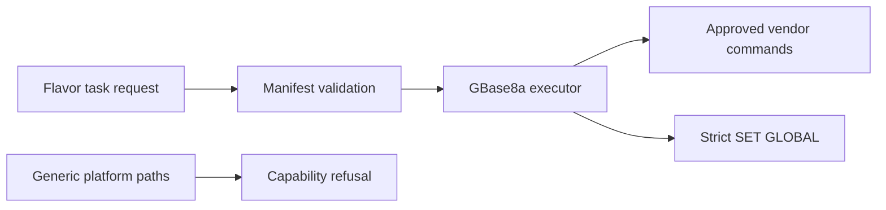

# GBase 8a 10.1 Dedicated Agent Design

Feature Name: gbase8a-10-1
Updated: 2026-08-04

## Description

The Agent adds a dedicated GBase 8a 10.1 deploy/configure executor. Backend and frontend capability tables preserve generic MySQL lifecycle refusal.

## Architecture

## Components and Interfaces

- `GBase8aConfig` carries DBA user, controlled install prefix, optional password-input mode, and parameter values.
- `gbase8a_task_executor.go` validates inputs, required manifest artifacts, fixed vendor commands, and the SQL allowlist.
- `flavor_capability.go` and `flavorCapability.ts` retain empty completed capabilities for `gbase8a`.

## Correctness Properties

- Deployment requires `requires_license`, a license file, and all four named manifest artifacts.
- Distribution receives only the manifest-verified `gcChangeInfo.xml` path and fixed single-node arguments.
- SQL emission is limited to `gcluster_rebalancing_concurrent_count` values 1 through 64.
- TLS execution returns before configuration changes until the restart command is vendor-verified.

## Error Handling

The executor returns failed task results for malformed paths, missing artifacts, invalid parameters, unavailable TLS restart evidence, and all operations outside deploy/configure.

## Test Strategy

Fixture tests record command arguments, verify refusal paths issue zero commands, validate the SQL allowlist, and assert generated TLS configuration content targets `[gbased]`.
