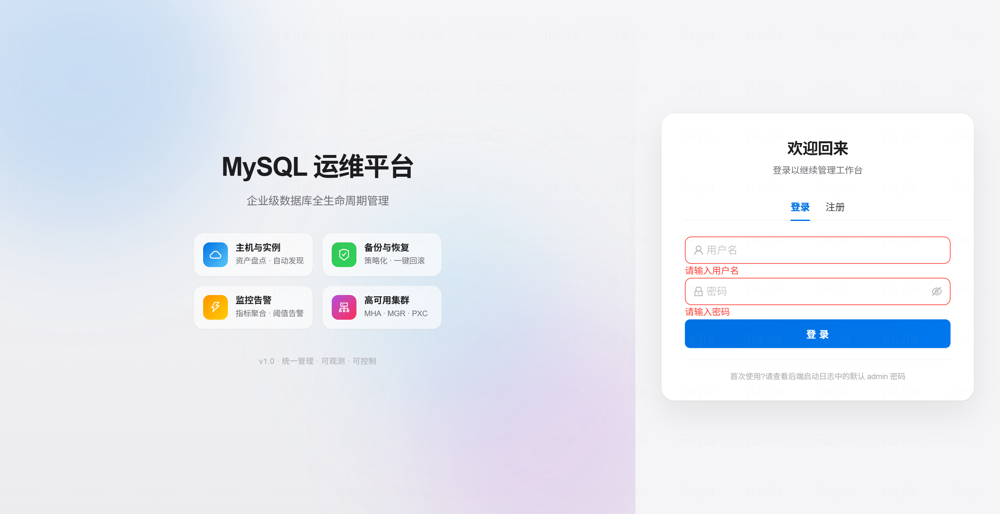
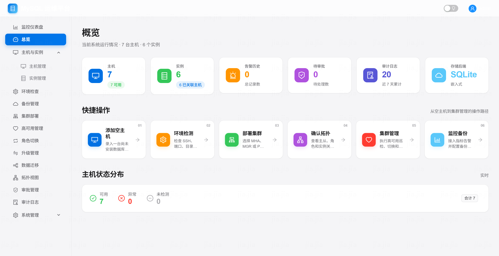
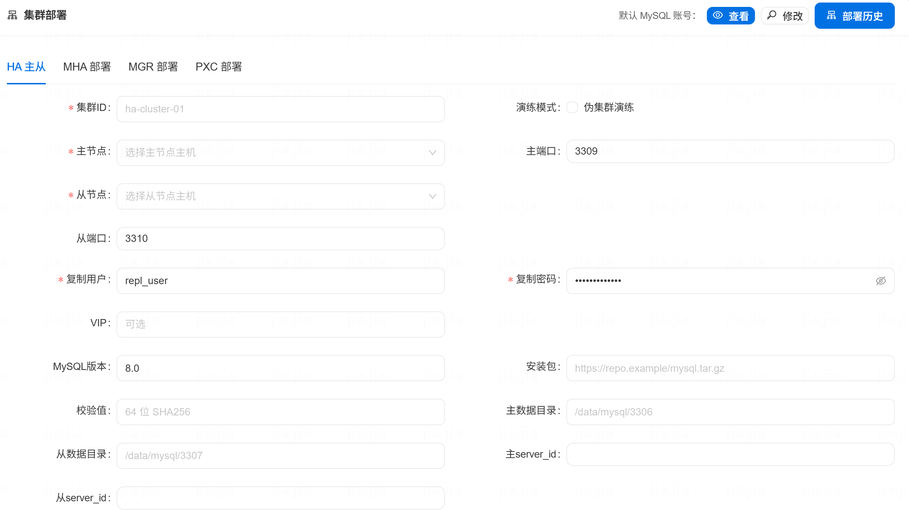
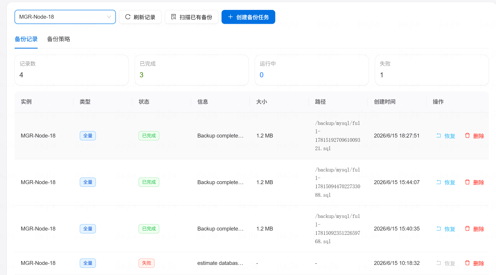
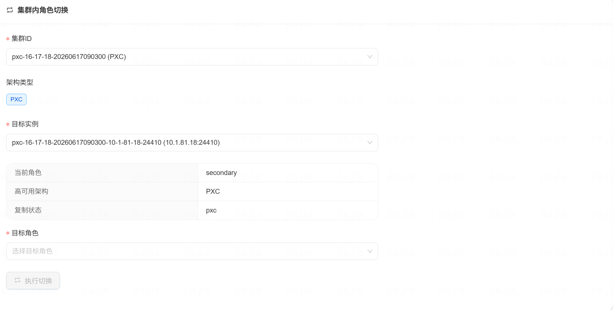
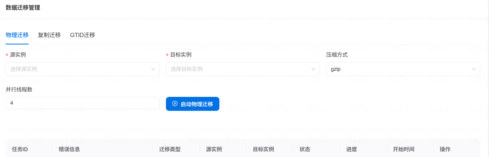
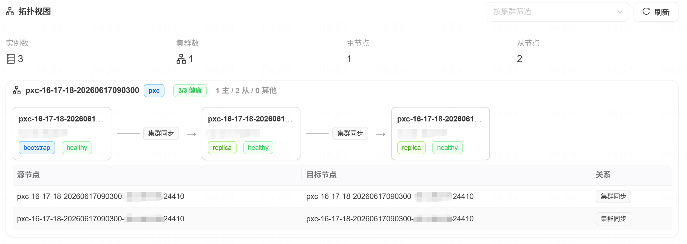

<div align="center">

# 智能 MySQL 运维平台

[![Go Version][go-image]][go-url] [![Node.js][node-image]][node-url] [![License][license-image]][license-url] [![Language][lang-image]][lang-url]

---

**[📖 中文文档 / Chinese Documentation](readme_ZH.md)** | **[📘 English Documentation / 英文文档](readme_US.md)**

</div>

---

## Screenshots / 界面展示

<div align="center">

### Login / 登录页面


### Dashboard / 主界面


### Cluster Deploy / 集群部署


### Backup Management / 备份管理


### Cluster Switch / 集群切换角色


### Data Migration / 数据迁移管理


### Topology View / 拓扑视图


</div>

---

## Tech Stack / 技术栈

| Component | Technology |
|-----------|------------|
| **Backend / 后端** | Go 1.25+ + Gin + SQLite/MySQL + Redis |
| **Frontend / 前端** | React 18 + TypeScript + Ant Design 5 |
| **Agent** | Go 1.21+ + HTTP + Bearer Token |

## Quick Start / 快速入门

```bash
# Build all components / 构建所有组件
make build

# Run tests / 运行测试
make test

# Start development environment / 启动开发环境
make install-web
```

## API Access / 访问地址

- **Backend Admin / 后台管理**: `http://localhost:8080`
- **Web Console / 控制台**: `http://localhost:3000`
- **Agent Service / Agent服务**: `http://localhost:9090`

## Commercial Editions / 商业版本

 - **CE** (社区版): 基础功能，MIT协议
 - **EE** (企业版): CE + 高可用/升级/迁移/审计功能  
 - **UE** (旗舰版): EE + AI智能化，商业授权

**联系方式：**

- **邮箱咨询** - ice_out@sina.com
- **在线咨询** - 通过GitHub提交企业工单

[go-image]: https://img.shields.io/badge/Go-1.25+-00ADD8?style=flat&logo=go
[go-url]: https://go.dev/
[node-image]: https://img.shields.io/badge/Node.js-18+-339933?style=flat&logo=node.js
[node-url]: https://nodejs.org/
[license-image]: https://img.shields.io/badge/License-MIT-blue.svg
[license-url]: https://opensource.org/licenses/MIT
[lang-image]: https://img.shields.io/badge/Language-Go%20%7C%20TypeScript-blue
[lang-url]: https://github.com/mingjia1/dbops
